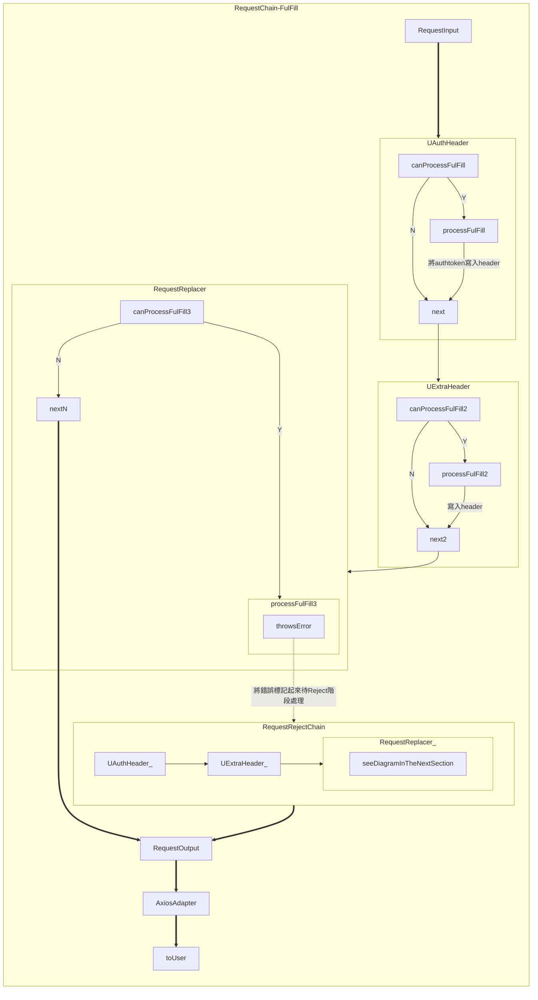
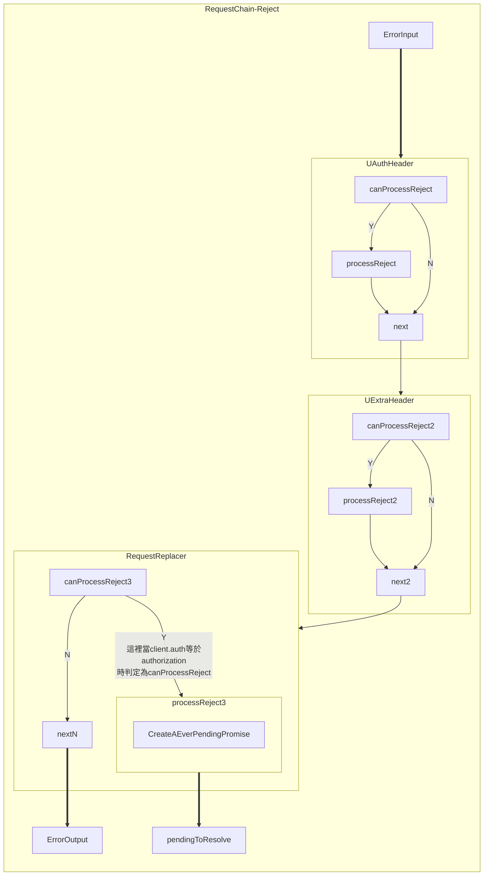
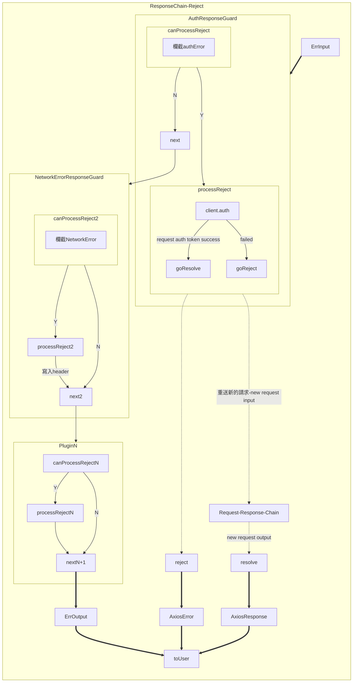

# 前端常用HttpRequestClient:

## 安裝
```bash
yarn add @gdknot/request_client
```
## documentation
```bash
yarn serve:doc
```
## Feature
- 責任鍊模組化串連以對 axios interceptors進行管理，共分為二㮔 Chain
  - request chain 請求鍊，對應 axios.interceptors.request, 包括
    - 基本 request chain
    - 常用 request chain 如:
      - header updater - 用來更新請求 header
      - request replacer － 用來替換已經送出的請求
  - response chain 回覆鍊，對應 axios.interceptors.response
    - 基本 response chain
    - 常用 response chain 如:
      - authGuard 欄截未正確授權的請求
- BaseRequestClient 一個常用的HttpClient － 應考處到自動處理授權換發
- axios mocking util, for easy mocking following things
  - mocking axios internal adapter hence we can test axios interceptors without breaking the internal part
  - a simple util for mocking server response
  
```ts
import {
  UpdateAuthHeaderPlugin,
  UpdateExtraHeaderPlugin,
} from "@/presets/request_header_updater";
import { AuthResponseGuard } from "@/presets/auth_response_guard";
import { NetworkErrorResponseGuard } from "@/presets/network_error_response_guard";
import { AxiosResponse } from "axios";
import { ClientOption } from "@/base/impl/client_impl";
import { RequestReplacer } from "@/presets/request_replacer";


export type DataResponse<T> = { 
  data: T; pager: any
 };
export type ErrorResponse = {
  error_key: string;
  error_code: string;
  error_msg: string;
  message: string;
};
export type SuccessResponse = { succeed: boolean };
export type AuthResponse = DataResponse<{
  token: string
}>

const timeout = 10 * 1000;
const baseURL = "http://localhost";

export const authToken = { value: "I'M Auth Token" };
export const formatHeader = { value: { format: "mock" } };
export const authUrl = "path/to/auth_url";


export const requestClientOption: ClientOption<
  DataResponse<any>,
  ErrorResponse,
  SuccessResponse
> = {
  isSuccessResponse: (s: any) => (s as SuccessResponse).succeed != undefined,
  isDataResponse: (d: any) => (d as DataResponse<any>).data != undefined,
  isErrorResponse: (e: any) => (e as ErrorResponse).error_code != undefined,
  axiosConfig: {
    baseURL,
    timeout,
  },
  requestChain: [
    new ClientRequestAuthHeaderUpdater(function () {
      return authToken.value;
    }),
    new ClientRequestExtraHeaderUpdater(function () {
      return formatHeader.value;
    }),
    new RequestReplacer(
      // replacementIdentifier = BaseRequestReplacer...
    ),
  ],
  responseChain: [
    new AuthResponseGuard(),
    new NetworkErrorResponseGuard(
      function networkError(error){
      console.log("detect network error:", error);
    }),
  ],
  authOption: {
    axiosConfig: {
      url: authUrl,
      baseURL,
      timeout: 12000,
    },
    interval: 600,
    requestChain: [],
    responseChain: [
      new ACFetchedMarker(),
      new ACTokenUpdater(),
      new ACAuthResponseGuard(),
      new ACIdleMarker(),
    ],
    payloadGetter: function () {
      return null;
    },
    tokenGetter: function () {
      console.log("tokenGetter:", authToken.value);
      return authToken.value;
    },
    tokenUpdater: function (response: AxiosResponse<any, any>): void {
      try{
        console.log("tokenUpdater", (response.data as any).data.token)
        authToken.value = (response.data as any).data.token;
      }catch(e){
        console.error("tokenUpdater error, response:", response, "\nerror:", e);
        throw e;
      }
    },
    redirect: function (response: AxiosResponse<any, any>) {
      console.log("redirect home");
      return null;
    },
  },
};
const client = new RequestClient(requestClientOption)
```

# Table of Content
<!-- START doctoc generated TOC please keep comment here to allow auto update -->
<!-- DON'T EDIT THIS SECTION, INSTEAD RE-RUN doctoc TO UPDATE -->
table of content

- [前端常用HttpRequestClient:](#%E5%89%8D%E7%AB%AF%E5%B8%B8%E7%94%A8httprequestclient)
  - [安裝](#%E5%AE%89%E8%A3%9D)
  - [documentation](#documentation)
  - [Feature](#feature)
- [Table of Content](#table-of-content)
  - [FontEnd Client:](#fontend-client)
    - [範例-Instantiate](#%E7%AF%84%E4%BE%8B-instantiate)
    - [完整範例-Instantiate](#%E5%AE%8C%E6%95%B4%E7%AF%84%E4%BE%8B-instantiate)
    - [換發 auth token](#%E6%8F%9B%E7%99%BC-auth-token)
  - [Request/Response Chain:](#requestresponse-chain)
    - [Request/Response 流程](#requestresponse-%E6%B5%81%E7%A8%8B)
    - [常用 Request Chain](#%E5%B8%B8%E7%94%A8-request-chain)
    - [常用 Response Chain](#%E5%B8%B8%E7%94%A8-response-chain)
    - [常用 Response Chain - for auth-specific axios instance](#%E5%B8%B8%E7%94%A8-response-chain---for-auth-specific-axios-instance)
    - [目前實作上的缺點](#%E7%9B%AE%E5%89%8D%E5%AF%A6%E4%BD%9C%E4%B8%8A%E7%9A%84%E7%BC%BA%E9%BB%9E)
  - [Mocking Axios:](#mocking-axios)
    - [How to Mock Axios Adapter](#how-to-mock-axios-adapter)
    - [Mock Server Response](#mock-server-response)
    - [Mock Axios.create](#mock-axioscreate)

<!-- END doctoc generated TOC please keep comment here to allow auto update -->


[s-baseAuthGard]: ../src/base/impl/base_auth_response_guard_impl.ts
[s-baseClientServiceResponsePlugin]: ../src/base/impl/response_plugins_impl.ts
[s-baseClientServiceRequestPlugin]: ../src/base/impl/request_plugins_impl.ts
[s-baseRequestReplacer]: ../src/base/impl/base_request_replacer_impl.ts
[s-baseRequestGuard]: ../src/base/impl/base_request_guard_impl.ts
[s-requestClient]: ../src/base/impl/client_impl.ts
[s-requestClient.types]: ../src/base/itf/client_itf.ts
[s-eClientStage]: ../src/presets/auth_client_guards.ts

[s-acAuthResponseGuard]: ../src/presets/auth_client_guards.ts
[s-acFetchedMarker]: ../src/presets/auth_client_guards.ts
[s-acIdleMarker]: ../src/presets/auth_client_guards.ts
[s-acTokenUpdater]: ../src/presets/auth_client_guards.ts

[s-authResponseGuard]: ../src/presets/auth_response_guard.ts
[s-networkErrorGuard]: ../src/presets/network_error_response_guard.ts
[s-headerUpdater]: ../src/presets/request_header_updater.ts
[s-requestReplacer]: ../src/presets/request_replacer.ts

[s-test-mocking]: ../__tests__/__mocks__/axios.ts
[s-test-helper]: ../__tests__/helpers/axo.test.helper.ts
[s-test-setup]: ../__tests__/setup/client.test.setup.ts


---
## FontEnd Client:
Client 主要以 Axios Http Request Client, 為基底，包裹了一些常用的處理流程，包括
- 自動換發 request auth token
- 換發 request auth token 時自動將其他請求放入queue 中待 auth token 返回後一併處理
- 當換發 auth token 間隔太短，小於 minimum interval between two authorization request，視為同一個 request。
- 以責任鍊方式實作 axios.interceptors.request, 提昇模組化，複用性
- 以責任鍊方式實作 axios.interceptors.response, 提昇模組化，複用性
- 由外部注入 response 型別判斷
  常用 response 型別有 error response (error_key/error_message) | data response | success response, 以利程式碼重複利用性


__型別__ | [source][s-requestClient]
```ts
/**  api client service 
 * @typeParam DATA - response 型別
 * @typeParam ERROR - error 型別
 * @typeParam SUCCESS - success 型別
*/
export abstract class IClientService<DATA , ERROR, SUCCESS>
    implements IApiClientMethods<DATA, ERROR, SUCCESS>
{   
    /** axios.interceptors.request 以責任鍊方式實作 */
    abstract requestChain: BaseClientServicesPluginChains<AxiosRequestConfig>[];
    /** axios.interceptors.response 以責任鍊方式實作 */
    abstract responseChain: BaseClientServicesPluginChains<
        AxiosResponse,
        Promise<AxiosResponse>
    >[];
    /** 用來放置需要先存入 pending 中的請求，如當 {@link stage} 處於 
     * {@link EClientStage.authorizing} 時，所有的請求會先存入 queue, 直到換發 auth token
     * 成功後再從 queue 裡面，次發出請求，以確保 client request 不會因為一些錯誤（如 unauthorized error)
     * 而中斷請求 */
    abstract queue: AsyncQueue;
    abstract axios: AxiosInstance;
    /** @readonly 用來代表 client 當前狀態 - idle / fetching / authorizing */
    readonly abstract stage: EClientStage;
    /** client 初始化時所注入與 authorization 相關的設定 @see {@link ClientAuthOption}*/
    abstract authOption: Required<ClientAuthOption>;
    /** 用來實作判定所返回的 response 屬於哪種資料型別 */
    abstract isDataResponse: (response: DATA | ERROR | SUCCESS)=> boolean;
    /** 用來實作判定所返回的 response 屬於哪種資料型別 */
    abstract isErrorResponse: (response: DATA | ERROR | SUCCESS)=> boolean;
    /** 用來實作判定所返回的 response 屬於哪種資料型別 */
    abstract isSuccessResponse: (response: DATA | ERROR | SUCCESS)=> boolean;

    /** onIdle callback, e.g.: client.onIdle(()=>console.log("..."))*/
    abstract onIdle(cb: ()=>void): void;
    /** onFetching callback, e.g.: client.onFetching(()=>console.log("...")) */
    abstract onFetching(cb: ()=>void):void;
    /** onAuthorizing callback, e.g.: client.onAuthorizing(()=>console.log("...")) */
    abstract onAuthorizing(cb: ()=>void):void;

    /** 同 get/post/put/del 只是 param 型別不同
     * @param option - {@link AxiosRequestConfig} */
    abstract requestByConfig(option: AxiosRequestConfig): Promise<AxiosResponse>;
    abstract get(
        url: string,
        payload: Record<string, any>
    ): Promise<DATA | ERROR>;
    abstract auth(): Promise<DATA | ERROR | SUCCESS>;
    abstract post(
        url: string,
        payload: Record<string, any>
    ): Promise<DATA | ERROR | SUCCESS>;
    abstract put(
        url: string,
        payload: Record<string, any>
    ): Promise<DATA | ERROR | SUCCESS>;
    abstract del(
        url: string,
        payload: Record<string, any>
    ): Promise<ERROR | SUCCESS>;
}
```

### 範例-Instantiate
| [source][s-test-setup]

```ts
const requestClientOption: ClientOption<
  DataResponse<any>,
  ErrorResponse,
  SuccessResponse
> = { ... }
new RequestClient(requestClientOption)
```

#### ClientOption

> 實例化 BaseClient 所需的參數，包括以下屬性
> - axiosConfig - 用於創建 AxiosInstance
> - authOption: [ClientAuthOption](#ClientAuthOption)
>   - 用於換發 auth token 相關設置
>   - 用於創建 auth token 換發專用的 AxiosInstance

__型別__ | [source][s-requestClient.types]
```ts
/**
 * {@link IClientService} 實例化的輸入參數 */
export type ClientOption<DATA, ERROR, SUCCESS> = {
  /** 創建一般性的 axios instance 所需的 Config，用於非 auth token 換發的請求*/
  axiosConfig: AxiosRequestConfig,
  /** axios.interceptors.request 以責任鍊方式實作 */
  requestChain: BaseClientServicesPluginChains<AxiosRequestConfig>[] ,
  /** axios.interceptors.response 以責任鍊方式實作 */
  responseChain: BaseClientServicesPluginChains<
    AxiosResponse,
    Promise<AxiosResponse>
  >[] ,
  /** 創建特別針對請求 auth token 換發所需的 axios instance，僅用於 auth token 換發*/
  authOption: ClientAuthOption,
  /** 用來實作判定所返回的 response 屬於哪種資料型別 */
  isErrorResponse: (error: ERROR|SUCCESS|DATA)=>boolean,
  /** 用來實作判定所返回的 response 屬於哪種資料型別 */
  isSuccessResponse: (success: ERROR|SUCCESS|DATA)=>boolean,
  /** 用來實作判定所返回的 response 屬於哪種資料型別 */
  isDataResponse: (data: ERROR|SUCCESS|DATA)=>boolean,
};
```

#### ClientAuthOption
> ClientAuthOption 用於換發 auth token 時所創建的 AxiosInstance，為了簡化，這個 AxiosInstance 特別用於 auth token 換發, 與原 axios instance 設置分開，不走 interceptors。
```ts
/** client 初始化時所注入與 authorization 相關的設定 */
export type ClientAuthOption = AxiosRequestConfig & {
    /** authorization url 不包括 baseURL */
    url: string,
    /** authorization baseURL */
    baseURL: string,
    /** axios timeout */
    timeout?: number,
    /** 如果換發 auth token 需要指定 payload，於內部會取用這個方法 */
    payloadGetter: ()=>any,
    /** 發出請求時，需要取當當前最新的 auth token，於內部會以此方法取得最新的 auth token 以更新 request header */
    tokenGetter: ()=>any,
    /** 當換發 token 後，內部需要調用寫入 token 的方法 */
    tokenUpdater: (response: AxiosResponse)=>void,
    /** 當 authorization 失敗後，會呼叫這個方法，以重新導向 */
    redirect?: (response: AxiosResponse)=>RedirectAction|undefined|null,
    /** 每二次 authorization 請求間的最小 interval */
    interval?: number,
}
```

### 完整範例-Instantiate

```ts
const timeout = 10 * 1000;
const baseURL = "http://localhost";

export const authToken = { value: "I'M Auth Token" };
export const formatHeader = { value: { format: "mock" } };
export const authUrl = "path/to/auth_url";

export const requestClientOption: ClientOption<
  DataResponse<any>,
  ErrorResponse,
  SuccessResponse
> = {
  isSuccessResponse: (s) => (s as SuccessResponse).succeed != undefined,
  isDataResponse: (d) => (d as DataResponse<any>).data != undefined,
  isErrorResponse: (e) => (e as ErrorResponse).error_code != undefined,
  config: {
    baseURL,
    timeout,
  },
  requestChain: [
    new UpdateAuthHeaderPlugin(function tokenGetter() {
      return authToken.value;
    }),
    new UpdateExtraHeaderPlugin(function headerGetter() {
      return formatHeader.value;
    }),
    new RequestReplacer(),
  ],
  responseChain: [
    new AuthResponseGuard(),
    new NetworkErrorResponseGuard(function onNetworkError(error){
      console.log("detect network error:", error);
    }),
  ],
  authOption: {
    url: authUrl,
    baseURL,
    timeout: 12000,
    interval: 600,
    payloadGetter: function () {
      return null;
    },
    tokenGetter: function () {
      return authToken.value;
    },
    tokenUpdater: function (response: AxiosResponse<any, any>): void {
      authToken.value = (response.data as any).data.token;
      console.log("tokenUpdater:", authToken.value);
    },
    redirect: function (response: AxiosResponse<any, any>) {
      console.log("redirect home");
      return null;
    },
  },
};
const client = new RequestClient(requestClientOption)
client.onIdle(()=>console.log("idle"));
client.onFetching(()=>console.log("fetching"));
client.onAuthorizing(()=>console.log("authorizing"));
```

> 上述例子中, 相當於 axios.interceptors.request | axios.interceptors.response，分別以責任鍊設計模式，寫入 onFulFill / onReject 流程，以下分別就 RequestChain / ResponseChain 的執行流程做說明：

##### RequestChain - onFulFill
> 前例中, request chain 有三個 plugin, 分別為 UpdateAuthHeader / UpdateExtraHeader / RequestReplacer, 他們以線性的方式依序執行，如下圖： [（見request-response-chain-完整說明）](#requestresponse-chain)



##### RequestChain - onReject

> 上圖， RequestReplacer 創建了一個永不 resolve 的 promise物件，於是 axios 處於 pending to resolve that ever pending promise，並將該 ever pending promise 存入 queue 中待使用者於後續處理。

#### Response-onFulFill

#### Response-onReject

> 前例中, response chain 有二個 plugin, 分別為 AuthResponseGuard / NetworkErrorResponseGuard, 他們會以線性的方式依序執行 [（見request-response-chain-完整說明）](#requestresponse-chain)





### 換發 auth token
> 換發 auth token 主要有以下二種情境
> - 使用者自行換發 auth token
> - 發出請求後，因auth token過期間接產生 unauthorized error

#### 使用者自行換發 auth token
為避免短時間內重複換發，於內部包裹一層 debouncer，限制任二
  次換發不得小於 600ms，若小於則以單次處理，但如果在換發尚未取得 Response 前又有另一個新的 request 送出，這個 request 一定會失敗，client如何處理這樣的問題呢
  ```ts
    const future1 = client.auth()
    const future2 = client.auth();
    expect(future1).toBe(future2); // 同一個 Promise object
    const response1 = await future1;
    const response2 = await future2;
    expect(response1).toEquals(response2); // 相同內容
    
  ```
#### Client.stage
當 Client.Auth 一執行時，Client.stage 便轉為 authorization，當 client.stage 為 EClientStage.authorization 時，透過 RequestChain (RequestReplacer)實作，我們可以將所有的 request 全部存到 queue 裡面，待 ResponseChain (AuthGuard/ todo:...) 成功換發後，會一次處理 queue 裡面的 request

#### auth token過期間接產生 unauthorized error
這時會透過 interceptor 自動換發 auth token，


#### queue: AsyncQueue

> 用來放置需要先存入 pending 中的請求，如當 {@link stage} 處於 {@link EClientStage.authorizing} 時，所有的請求會先存入 queue，並返回 queue 裡的 Promise 物件，該Promise物件會持續等待 (pending), 直到換發 auth token 成功後再從 queue 裡面，取得相應的 completer 並再次發出請求取，以返回相應的結果至特定的 completer，於是 client 便能取得正確的結果， client request 不會因為一些錯誤（如 unauthorized error) 而中斷請求。

> queue 為 [Completer](#Completer)<QueueItem> 物件陣列, QueueItem 有以下屬性
```ts
export type QueueItem<M=any> = {
  /** id: QueueItem identifier */
  id: number|string;
  /** meta: 用以儲存額外資訊，如 request config / request header */
  meta?: M;
  /** promise: 用來取得QueueItem所承載的非同步資料 */
  promise: () => Promise<any>;
  /** timestamp: 用來計算 timeout */
  timestamp: number;
  /** timeout: timeout id */
  timeout: NodeJS.Timeout;
};
```

> completer 本身類似 Promise 物件, 只是多了以下屬性
[source][s-completer]
```ts
abstract class _Completer<T> {
  /** 用來暫時代表 future 值的物件，也可作為 Completer 本身的註解 */
  abstract _meta?: T
  /** 即 Promise 物件本身, 其 resolve / reject 方法分別為
   * {@link complete} / {@link reject} */
  abstract future: Promise<T>;
  /** 同 Promise.resolve, resolve {@link future} 本身*/
  abstract complete(value: T | PromiseLike<T>) : void;
  /** 同 Promise.reject, reject {@link future} 本身 */
  abstract reject(reason?: any): void;
}
```

當我們以 [Completer](#Completer) 存放 QueueItem 物件時便能於外部 resolve Promise,  而不用受限於 Promise 結構只能於自身建溝子進行 resolve，[Completer](#Completer)本身則作為一個容器，存放 Promise 物件及相應 reject/resolve 方法，以便於外部調用. 

#### queue.enqueue
> 將 Promise 請求包入 QueueItem 並推到 Queue 裡，並有以下二種選擇 (視 @param dequeueImmediately)
> -  同時執行 promise 非同部請求 via [dequeue](#dequeue) ，直到非同部請求 promise resolve 後， 使用者再次 [dequeue](#dequeue) 移除該列隊
> - 不立即執行 promise 非同部請求 [dequeue](#dequeue) ，直到使用者自行 [dequeue](#dequeue) 後，移除該列隊
  
__型別__:
```ts
/**
 * @param id - 請求 ID
 * @param promise - 處理非同部請求邏輯，待請求完成後，queue 生命周期完成移除
 * @param timeout - default 10 * 1000
 * @param meta - 使用者自定義註解
 * @param dequeueImmediately - enqueue 後馬上 dequeue，即執上 promise 直到 promise resolve 後
 */
  public enqueue(
    id: number|string,
    promise: () => Promise<any>,
    timeout: number = 10000,
    meta: any = {},
    dequeueImmediately: boolean = true,
  ): Promise<any>
```

__example__ | [source][s-test-queue]:
> 立即執行 promise 非同部請求
```ts
jest.spyOn(q, "dequeue");
q.enqueue(idC, async ()=>{
  return new Promise(async resolve =>{
    console.log("promise called")
    await wait(span);
    resolve({idC});
  });
});
expect(q.queue.length).toBe(1);
expect(q.dequeue).toBeCalledTimes(1); // promise called

await q.dequeue({id: idC, removeQueue});
expect(q.queue.length).toBe(0);
```
__example__
> 不立即執行 promise 非同部請求，直到使用者自行 {@link dequeue}
```ts
const removeQueue = false;
jest.spyOn(q, "dequeue");
q.enqueue(idC, async ()=>{
  return new Promise(async resolve =>{
    await wait(span);
    resolve({idC});
  });
}, removeQueue);
expect(q.queue.length).toBe(1);
expect(q.dequeue).toBeCalledTimes(0);

await q.dequeue({id: idC, removeQueue});
expect(q.queue.length).toBe(0);
expect(q.dequeue).toBeCalledTimes(1);
```


#### queue.dequeue
> 依所提供的 id 查找相應的 QueueItem，執行 QueueItem 裡的 Promise 請求並依
  option.removeQueue 決定是否移除 QueueItem, 預設 option.removeQueue 為 true

__型別__:
```ts
/**
 * @param option.id - 取得queue的id
 * @param option.removeQueue - 預設 true
 */
public async dequeue(option: {id: number, removeQueue?: boolean}): Promise<any>
```

__example__ | [source][s-test-queue]:
```ts
test("expect raise exception while it's queuing", async () => {
  let rA, rB, rC, rD;
  let [wA, wB, wC, wD] = [100, 200, 600, 800];
  const t = time();
  const removeQueue = true;
  const meta = {};

  jest.spyOn(q, "dequeue");
  q.enqueue(idA, async () => {
    return new Promise(async (resolve) => {
      await wait(wA);
      rA = { idA };
      resolve({ idA });
      console.log("resolve A");
    });
  });
  expect(q.queue.length).toBe(1);
  expect(q.dequeue).toBeCalledTimes(1);

  expect(
    q.enqueue(idB, async () => {
      return new Promise(async (resolve, reject) => {
        await wait(wB);
        reject("reject...");
        console.log("resolve B");
      });
    })
  ).rejects.toEqual("reject...");
  expect(q.queue.length).toBe(2);
  expect(q.dequeue).toBeCalledTimes(2);

  q.enqueue(idC, async () => {
    return new Promise(async (resolve) => {
      await wait(wC);
      rC = { idC };
      resolve({ idC });
      console.log("resolve C");
    });
  });
  expect(q.queue.length).toBe(3);
  expect(q.dequeue).toBeCalledTimes(3);

  await wait(wA + wB + wC + 30);
  // 雖然 dequeue, 但內部不移除，直到使用者 dequeue
  expect(q.queue.length).toBe(3);

  const resultA = await q.dequeue({ id: idA });
  expect(resultA).toEqual({ idA });
  expect(q.queue.length).toBe(2);

  const resultC = await q.dequeue({ id: idC });
  expect(resultC).toEqual({ idC });
  expect(q.queue.length).toBe(1);

  const resultB = await q.dequeue({ id: idB });
  expect(q.queue.length).toBe(0);
});
```


#### queue.dequeueByResult
> 別於 [dequeue](#dequeue) 執行 [enqueue](#enqueue) 傳入的 promise 方法，待 promise 請求 resolve 後移除 {@link QueueItem}, [dequeueByResult](#dequeueByResult) 則是不管 [enqueue](#enqueue) 所傳入的 promise 結果，直接取代其 result

__型別__:
```ts
  /**
   * @param option.id - 取得queue的id
   * @param option.removeQueue - 預設 true
   */
  public async dequeueByResult(option: {id: number, result: any}): Promise<any>
```

__example__ | [source][s-test-queue]:
```ts
const pendingId = "idA";
const pending = q.enqueue(pendingId, async ()=>{
  // 這裡 promise 不回傳結果，直接等待十秒後 timeout
  return waitForTimeOut(10 * 1000);
});
// 覆寫內容於是能將值返回, pending 狀態於是 resolved 
q.dequeueByResult({id: pendingId, result: {succeed: true}});
expect(pending).resolves.toEquals({succeed: true});
```
#### queue.getQueueItem
```ts
  getQueueItem(id:number|string):Completer<QueueItem> | null{
    if (this.queue.length == 0)
      return null;
    return this.queue.firstWhere((_)=>_._meta!.id == id);
  }
```

#### queue.enqueueWithoutId
```ts
/** 與  {@link enqueue} 相同，只是 id 自動生成 */
public enqueueWithoutId(
  promise: () => Promise<any>,
  timeout: number = 10000,
  meta: any = {},
  dequeueImmediately: boolean = true,
)
```

#### queue.clearQueue
```ts
/**清除 {@link queue} */
public clearQueue(): void {
  for (let index = 0; index < this.queue.length; index++) {
    const item = this.queue[index];
    this.remove(item, true);
  }
}
```

---
## Request/Response Chain:
### Request/Response 流程

實作主要建立在 axios 處理 interceptor 流程的基礎上，只是用 responsibility chain 的設計模式模組化，原 axios interceptors 有二個部份，即 Request/Response 各自分為 onFulFill/onReject 二個流程

- Request
  - onFulFill
    - canProcessFulFill > processFulFill
  - onReject
    - canProcessReject > processReject
- Response
  - onFulFill
    - canProcessFulFill > processFulFill
  - onReject
    - canProcessReject > processReject

每個流程都必需實作 canProcess/process 二個方法, canProcess 用來定是否能夠進入 process， process 則用來處理上一個 chain 所輪出的值，處理後再丟給下一個 chain 的 process 作為下一個 chain 的輪入值.

> 意即在原來的 interceptor 中插入

```ts
axios.interceptors.response.use(
  function(requestConfig){
    if (chain1.canProcessOnFulFill(requestConfig)){
      requestConfig = chain1.processFulFill(requestConfig)
    }
    if (chainN.canProcessOnFulFill(requestConfig)){
      ...
    }
  },
  function(error){
	// ...
  })
```

> 若用責任鍊自我遞迴的方式改寫

```ts
function processResponseFulFill(
  response: AxiosResponse,
  chain?: BaseClientServicesPluginChains<any, any, any>
): Promise<AxiosResponse> {
  if (!chain)
    return Promise.resolve(response); // 結束責任鍊
  if (ensureCanProcessFulFill(() => onStage(chain, response, EMethod.canProcessFulFill))) {
    return onStage(chain, response, EMethod.processFulFill); // chain
  } else {
    if (chain.next && chain.canGoNext(response.config!)) {
      return processResponseFulFill(response, chain.next); // next chain
    }
    return processResponseFulFill(response, undefined);
  }
}

function onResponseFulFilled(chain: BaseClientServicesPluginChains){
  return (response: AxiosResponse): Promise<AxiosResponse> => {
    return processResponseFulFill(response, chain);
  }
}

axios.interceptors.response.use(
	onResponseFulFilled(masterChain),
	onResponseReject(masterChain)
)
axios.interceptors.request.use(
	...
)
```

以上當 chain undefined 時， return Promise.resolve 結束責任鍊，其他狀態則續繼下一個責任鍊，canProcessFulFull 為當前 chain 用來判定是否執行的依據，canGoNext 則是當前 chain 用來控制是否執行下一個 chain 的依據，預設為 true, 不建議 override 這個值。

```ts
/** default: true */
public canGoNext(config: INPUT): boolean {
	return this.next != undefined;
}
```

Chain 共分為二大類，ResponseChain / RequestChain 分別對應 axios.interceptors.response / axios.interceptors.request，每個 Chain 再各自分為 onFulFill / onReject 分別用作 Promise resolve / Promise reject 的非同部流程，以下分別就這幾個流程作細部說明。

#### ResponseChain

##### onFulFill/onReject 流程

```mermaid
flowchart LR;
	subgraph ResolveChainOfResponse - ResponseChain-FulFill
		direction TB
    	subgraph PluginN
			direction TB
			canProcessFulFillN-->|Y|processFulFillN-->|path-of-chain\ncontinuing-the-reset-of-chains|nextN+1
			canProcessFulFillN-->|N|nextN+1
		end

		subgraph processFulFillN[returned value in processFulFill determines the next flow]
			direction LR
			this.resolve-.->|resolve current chain\nand continue the rest|Next\nResolveChainOfResponse
      		this.resolveAndIgnoreAll-.->|resolve current chain\nand breaking the reset|resolve_
			this.reject-.->|reject current chain\nand continue the reset|Next\nRejectChainOfResponse
			this.rejectAndIgnoreAll-.->|resolve current chain\nand breaking the reset|reject_
		end

		subgraph nextN+1[Next\nChain]
			direction TB
		end

		ResponseInput[response input\nAxiosResponse]==>PluginN
		nextN+1==>ResponseOutput[ResponseOutput\nAxiosError/AxiosResponse]
		nextN+1-->nextN+1

		processFulFillN-....->|path-of-reject\nbreaking-the-rest-of-chains|reject
		processFulFillN-....->|path-of-resolve\nbreaking-the-rest-of-chains|resolve
		ResponseOutput==>User
		resolve==>AxiosResponse
    	AxiosResponse==>User
		reject==>AxiosError==>User
	end
```

> - canProcessFulFill 決定是否進入 processFulFill, 若否則走下一個 chain
> - processFulFill 實作時其返回值會導致 axios 在處埋 interceptors 分別走上不同的路徑
>   - return this.resolve
>     resolve 當前 chain 並繼續 resolve 下一個 ResponseChain
>   - return this.rejectAndIgnoreAll(即 Promise.reject)
>     進入 ResponseChain-onReject 路徑
>   - return this.reject
>     reject 當前 chain 並繼續 reject 下一個 ResponseChain
>   - return this.resolveAndIgnoreAll(即 Promise.resolve)
>     resolve 當前 chain 並結束整個 response chain

##### resolve

resolve response 並且繼續下一個 response chain

```ts
protected resolve<T = AxiosResponse<any, any> | AxiosRequestConfig<any>>(configOrResponse: T): Promise<T>
```

##### resolveAndIgnoreAll

resolve response 並結束整個 response chain

```ts
protected resolveAndIgnoreAll<T = AxiosResponse<any, any> | AxiosRequestConfig<any>>(configOrResponse: T): Promise<T>
```

##### reject

reject response 並且繼續下一個 response chain

```ts
protected reject<T = AxiosResponse<any, any> | AxiosError<unknown, any> | AxiosRequestConfig<any>>(input: T): Promise<T>
```

##### rejectAndIgnoreAll

reject response 並結束整個 response chain

```ts
protected rejectAndIgnoreAll<T = AxiosResponse<any, any> | AxiosError<unknown, any> | AxiosRequestConfig<any>>(input: T): Promise<T>
```

##### processFulFill

axios response interceptor onFulFill 時執行，
覆寫請記得 return this.resolve responsibility chain
不會繼續.

```ts
processFulFill(response: AxiosResponse): Promise<AxiosResponse>
```

##### processReject

axios response interceptor onReject 時執行，
覆寫請記得 return this.reject，不然 responsibility chain
不會繼續.

```ts
processReject(error: AxiosError): Promise<AxiosError | AxiosResponse>
```

#### RequestChain

##### onFulFill/onReject 流程

```mermaid
flowchart LR;
	subgraph ResponseChain-FulFill
		direction TB
    	subgraph PluginN
			direction TB
			canProcessFulFillN-->|Y|processFulFillN-->|path-of-chain\ncontinuing-the-reset-of-chains|nextN+1
			canProcessFulFillN-->|N|nextN+1
		end

		subgraph processFulFillN[returned value in processFulFill determines the next flow]
			direction LR
			this.resolve-.->|resolve current chain\nand continue the rest|Next\nResolveChainOfResponse
      		this.resolveAndIgnoreAll-.->|resolve current chain\nand breaking the reset|resolve_
			this.reject-.->|reject current chain\nand continue the reset|Next\nRejectChainOfResponse
			this.rejectAndIgnoreAll-.->|resolve current chain\nand breaking the reset|reject_
		end

		subgraph nextN+1[Next\nChain]
			direction TB
		end

		subgraph ResponseChain
			direction TB
			resolveChain-->AxiosResponse_
			rejectChain-->AxiosError_
		end

		nextN+1-->nextN+1
		RequestInput==>PluginN
		nextN+1==>RequestOutput==>AxiosAdapter
		RemoteServer==>AxiosAdapter
		AxiosAdapter==>ResponseChain
		ResponseChain==>toUser[User]

		processFulFillN-....->|path-of-resolve\nbreaking-the-rest-of-chains|resolve
		processFulFillN-....->|path-of-reject\nbreaking-the-rest-of-chains|reject
		resolve==>RequestOutput
		reject==>AxiosError==>toUser
	end
```

##### resolve

resolve request 並且繼續下一個 request chain

```ts
resolve<T=AxiosRequestConfig<any>>(configOrResponse: T): T
```

##### resolveAndIgnoreAll

resolve request 並結束整個 request chain

```ts
resolveAndIgnoreAll<T = AxiosResponse<any, any> | AxiosRequestConfig<any>>(configOrResponse: T): Promise<T>
```

##### reject

reject request 並且繼續下一個 request chain

```ts
reject<T = AxiosResponse<any, any> | AxiosError<unknown, any> | AxiosRequestConfig<any>>(input: T): Promise<T>
```

##### rejectAndIgnoreAll

reject request 並結束整個 request chain

```ts
rejectAndIgnoreAll<T = AxiosResponse<any, any> | AxiosError<unknown, any> | AxiosRequestConfig<any>>(input: T): Promise<T>
```

##### processFulFill

axios request interceptor onFulFill 時執行，
覆寫請記得 return this.resolve responsibility chain
不會繼續.

```ts
processFulFill(config: AxiosRequestConfig): AxiosRequestConfig
```

##### processReject

axios request interceptor onReject 時執行，
覆寫請記得 return this.reject，不然 responsibility chain
不會繼續.

```ts
processReject(error: AxiosError): Promise<any>
```


---


### 常用 Request Chain
#### RequestReplacer

透過 canProcessFulFill 用來選擇什麼情況下要取代當前的 request, 當 canProcessFulFill 為 true 時，進入 processFulFill 以取代當前的 request， 如下例：

> 當 client stage 為 authorizing 時，代表此時 client 正在取得 authorization token, 這時任何的 request 所送出的 authorization token 均將會是舊的，在取得 authorization token 前，任何 request 都應放入駐列中容後處理，直到 authorization token 換發成功後，再處理駐列中的請求，而 Request Replacer 正是用於這一類的情境

[source](#s-requestReplacer)

````ts
/**
 * {@inheritdoc BaseRequestGuard}
 *
 * 使用情境如，當第一個 request 出現 Unauthorized 錯誤時，
 * 後續所有的 request 在第一個 request 重新換發 token 並返回正確的 request 前, 都
 * 需要等待，這時就需要直接取代 request, 讓它保持 pending 待第一個 request 換發成功
 * 後再行處理，流程為
 * - request
 *    {@link canProcessFulFill} > {@link processFulFill}
 * - response
 *    {@link canProcessReject} > {@link processReject}
 *
 * @typeParam RESPONSE - response 型別
 * @typeParam ERROR - error 型別
 * @typeParam SUCCESS - success 型別
 */
export class RequestReplacer<
  RESPONSE,
  ERROR,
  SUCCESS
> extends BaseRequestReplacer<RESPONSE, ERROR, SUCCESS> {
  /**
   * 當 {@link canProcessFulFill} 為 true 則可以進行 {@link processFulFill}，這裡
   * {@link canProcessFulFill} 只處理當 client 狀態為 {@link EClientStage.authorizing} 時，
   * 代表client正處於換發 authorization token， 這時應處理所有進來的 request, 替代成 pending
   * @returns -
   * ```ts
   * this.client!.stage == EClientStage.authorizing
   * ```
   * */
  canProcessFulFill(config: AxiosRequestConfig<any>): boolean {
    return this.client!.stage == EClientStage.authorizing;
  }
  /**
   * @extendSummary -
   * 當{@link canProcessFulFill}成立，強制將 request raise exception, 好進行至
   * reject進行攔截
   * */
  processFulFill(config: AxiosRequestConfig<any>): AxiosRequestConfig<any> {
    return this.switchIntoRejectResponse(config, BaseRequestReplacer.name);
  }

  /** false */
  canProcessReject(error: AxiosError<unknown, any>): boolean {
    return false;
  }
}
````

### 常用 Response Chain
#### AuthResponseGuard

用來處理當 request 發出後, 於 response 出現 401/Unauthorized error，這時原有的 request 會被放入駐列中保留，待 auth token 成功換發完後再次送出，處理流程為

- canProcessFulFill 
  - processFulFill
    - onRestoreRequest - 保留請求
    - onRequestNewAuth - 換發 auth token
      - onAuthError - 當 auth token 換發失败
      - onAuthSuccess - 當 auth token 換發成功
      - onAuthUncaughtError - 當 auth token 換發錯誤

[source](#s-authResponseGuard)

```ts
export class AuthResponseGuard extends BaseAuthResponseGuard {
  /** ### 用來定義當 unauthorized error 後，auth token 換發時的主要邏輯, 預設為 this.client.auth()
   * @param error - {@link AxiosError}
   * @param pendingRequest - 由{@link onRestoreRequest} 所生成的 pendingRequest，
   * 其內容為一個永不 resolve 的 Promise 物件，直到 auth token 重新換發後再次重新送出原請求，才
   * 會更新 pendingRequest 的內容，在這之前 pendingRequest 的 Promise 物件會一直保持 pending，
   * 除非 timeout
   */
  protected onRequestNewAuth(error: AxiosError): Promise<AxiosResponse> {
    return super.onRequestNewAuth(error);
  }

  /** ### 用來生成代替 unauthorized error 的空請求
   * 當 unauthorized error 後，auth token 換發前，會生成一個空的 Promise 請求，
   * 以代替原請求因 unauthorized error 所產生的錯誤，{@link BaseAuthResponseGuard} 會先
   * 返回這個空的 Promise 好讓原 axios 的請求持續等待。
   * @param error - {@link AxiosError}
   * @returns - {@link Completer<any, QueueItem>}
   */
  protected onRestoreRequest(error: AxiosError): Completer<any, QueueItem> {
    return super.onRestoreRequest(error);
  }

  protected async reject<
    T =
      | AxiosResponse<any, any>
      | AxiosRequestConfig<any>
      | AxiosError<unknown, any>
  >(input: T): Promise<T> {
    try {
      const error = input as AxiosError;
      const pending = this.onRestoreRequest(error);
      D.info([
        "onRestoreRequest A",
        error.config?.url,
        this.client?.queue.queue.length,
      ]);
      const authResponse = await this.onRequestNewAuth(error);
      return pending.future;
    } catch (e) {
      throw e;
    }
  }

  processReject(
    error: AxiosError<unknown, any>
  ): Promise<AxiosResponse<any, any> | AxiosError<unknown, any>> {
    if (
      this.isDirtiedBy(
        error,
        ACAuthResponseGuard.name,
        ChainActionStage.processResponse
      )
    ) {
      return this.rejectAndIgnoreAll(error);
    }
    return this.reject(error);
  }
}
```

### 常用 Response Chain - for auth-specific axios instance
為了在流程上方便撰寫，專門化一個 axios instance（以下暫稱AuthClient/AcXXX） 獨立於一般性的 axios interceptors，用來處理換發auth token 時的 Response/Request Chain, 與一般性的 Response/Request Chain 分開

- AuthClientStageMarker 
  用來標定目前的 auth client 的 stage
  - ACFetchedMarker (標定為 fetched)
  - ACIdleMarker (標定為 idle)
- ACTokenUpdater
  用來更新 token
- ACAuthResponseGuard
  當換發成功後，處理駐列中的請求

#### ACFetchedMarker
用來標定目前的 AuthClient [stage](#-eclientStage) 處於 auth token fetched 階段 

[source](#s-acFetchedMarker)
```ts
/** 用來標定目前的 auth client stage 處於 auth token fetched 階段 
 * @see {@link EClientStage}
*/
export class ACFetchedMarker extends AuthClientStageMarker {
  canProcessFulFill(config: AxiosResponse<any, any>): boolean {
    this.client!.markFetched();
    return super.canProcessFulFill(config);
  }
  canProcessReject(error: AxiosError<unknown, any>): boolean {
    this.client!.markFetched();
    return super.canProcessReject(error);
  }
}
```

#### ACIdleMarker
用來標定目前的 AuthClient [stage](#-eclientStage) 處於 idle 階段 
[source](#s-acIdleMarker)
```ts
export class ACIdleMarker extends AuthClientStageMarker {
  canProcessFulFill(config: AxiosResponse<any, any>): boolean {
    this.client!.markIdle();
    return super.canProcessFulFill(config);
  }
  canProcessReject(error: AxiosError<unknown, any>): boolean {
    this.client!.markIdle();
    return super.canProcessReject(error);
  }
}
```

#### ACTokenUpdater
當 auth token 成功取得後，用來更新當前前的 auth token，並將標定目前的 AuthClient stage 處於 updated 階段 
[source](#s-acTokenUpdater)
```ts
export class ACTokenUpdater extends AuthClientResponseGuard {
  canProcessFulFill(response: AxiosResponse<any, any>): boolean {
    return this.host.isDataResponse(response)
      && (response.status == axios.HttpStatusCode.Ok);
  }
  processFulFill(response: AxiosResponse<any, any>): Promise<AxiosResponse<any, any>> {
    this.client?.option.tokenUpdater(response)
    D.current(["ACTokenUpdater:", response.data, this.client?.option.tokenGetter()])
    if (this.client?.option.tokenGetter() == undefined){
      throw new Error("Unexpected tokenGetter/tokenUpdater");
    }
    this.client?.markUpdated();
    return this.resolve(response);
  }
  canProcessReject(error: AxiosError<unknown, any>): boolean {
    return false;
  }
}
```

#### ACAuthResponseGuard
處理以下請況

1) 用來處理當非AuthClient 送出的請求於遠端返回 unauthorized error (response error) 發生後 AuthResponseGuard 會將原請求放到駐列中，並透過 AuthClient 發出換發 token 請求, AuthClient interceptor 透過讀取當 auth token 成功換發且更新後，若駐列中有未完成的請求，則 ACAuthResponseGuard 會負責將這些請求重新送出
  
2) 當 AuthClient 換發 token 失敗

[source](#s-acAuthResponseGuard)


### 目前實作上的缺點
- 責任鍊有前後相依性，目前正以 GroupChain / GeneralChain 的方式改善


## Mocking Axios:
### How to Mock Axios Adapter
axios adapter 是 axios 源碼中負責處理 http/xhr request 的部份，如果直接 mock axios 裡的 request|get|put|del|... 這些方法，會中斷 axios 內部的邏輯（即 interceptors)，axios request 方法會呼叫 dispatchEmit, 而 dispatchEmit 會引用 adapter，所以如果真的要 mocking axios response 而不影響 axios 的內部邏輯，最好的方法是直接 mock adapter，方法只要在 AxiosRequestConfig 中注入自定義 Adapter 即可，透過 mockAdapter，可以決定應該返從 server 端返回什麼值。


#### AxiosRequestConfig 自定義 Adapter
如下例，axios.create 所創建的 instance 均使用自定義 Adapter | [source][s-test-mocking]

```ts
function mockAxiosCreate(
  mockAxios: jest.Mocked<AxiosStatic>,
  mockServer: MockedServer,
  mockAdapter: jest.Mocked<any>
) {
  const origCreate = jest.spyOn(axios, "create") as any;
  let instances: jest.Mocked<AxiosInstance>[] = [];

  mockAxios.create = ((config: CreateAxiosDefaults) => {
    // 直接將 adapter 塞入 config
    config.adapter = mockAdapter as any;
    const _origInst = origCreate(config);
    const _origRequest = _origInst.request.bind(_origInst);
    assert(() => _origInst != undefined);
    ...
```

#### 自定義 Adapter
如下例，adapter 的作用，除了 set header 便是由 server 取得 response, 這宙多了一個mockServer 用來模擬 server 端的資料，如處理 request header 是否正確, 是否該 throw unauthorized error
```ts
function getMockedAdapter(mockServer: MockedServer): jest.Mock<any> {
  const mockAdapter = jest.fn((config) => {
    config.headers.set("User-Agent", "axios/" + "1.2.1", false);
    const response = mockServer.getResponse(config);
    config.data = response;
    return response;
  });
  (mockAdapter as any).__name__ = "mockAdapter";
  return mockAdapter;
}
```

### Mock Server Response
__型別__ | [source][s-test-mocking]
```ts
abstract class IMockedServer {
  abstract setHeaderValidator(
    validator: (
      config: AxiosRequestConfig
    ) => AxiosResponse | AxiosError | undefined | null
  ): void;
  abstract registerResponse(
    url: string,
    response: any,
    useValidator: boolean
  ): void;
  abstract getResponse(
    config: AxiosRequestConfig
  ): Promise<AxiosResponse | AxiosError>;
}
```

#### registerResponse
針對特定的請求 url 註冊返回一個特定的結果 response (mockResult)

```ts
registerResponse(
  url: string,response: any,
  useValidator: boolean
): void;
```

__example__
| [source][s-test-helper]
```ts
const _url = (new URL(url, 'http://localhost'))
_url.search = new URLSearchParams(payload).toString();
//針對 url mock result
mockServer.registerResponse(url, result());
expect(client.get(url, payload)).resolves.toEqual(result())
```

#### getResponse
由 mockServer 取回 response, 於 adapter 內呼叫
```ts
getResponse(config: AxiosRequestConfig): Promise<AxiosResponse | AxiosError>;
```

#### setHeaderValidator
mockServer 用來驗證 request header 是否正確, 以返回錯誤的 response，如下驗證 auth token 是否正確, 若正確返回null, 若不正確返回 axios.HttpStatusCode.Unauthorized:

```ts
mockServer.setHeaderValidator((config: AxiosRequestConfig) => {
  try {
    const token = (config.headers as AxiosHeaders).get("Authorization");
    const authorized = token == authToken.value;
    // 無錯誤
    if (authorized) return null;

    const name = "Unauthorized";
    const message = name;
    const statusText = name;
    const response: AxiosResponse = {
      data: {
        message,
        error_name: name,
        error_code: axios.HttpStatusCode.Unauthorized,
        error_key: name,
      },
      status: axios.HttpStatusCode.Unauthorized,
      statusText,
      headers: {},
      config,
    };
    return response;
  } catch (e) {
    console.error("setAuthHeaderGuard failed, config:", config);
    throw e;
  }
});
```

### Mock Axios.create
```ts
mockAxios.create = ((config: CreateAxiosDefaults) => {
  config.adapter = mockAdapter as any;
  const _origInst = origCreate(config);
  const _origRequest = _origInst.request.bind(_origInst);
  assert(() => _origInst != undefined);

  const inst: jest.Mocked<AxiosInstance> = jest.mocked(_origInst);
  jest.spyOn(inst, "get");
  jest.spyOn(inst, "put");
  jest.spyOn(inst, "delete");
  jest.spyOn(inst, "post");
  jest.spyOn(inst, "request");

  assert(() => inst != undefined);
  assert(() => inst.get.mock != undefined);

  instances.push(inst);
  const origUseRequest = inst.interceptors.request.use.bind(
    inst.interceptors.request
  );
  const origUseResponse = inst.interceptors.response.use.bind(
    inst.interceptors.response
  );
  inst.interceptors.request.use = jest.fn((fulfilled, rejected, options) => {
    return origUseRequest(fulfilled, rejected, options);
  }) as any;
  inst.interceptors.response.use = jest.fn((fulfilled, rejected, options) => {
    return origUseResponse(fulfilled, rejected, options);
  }) as any;
  return inst;
}) as any;
```