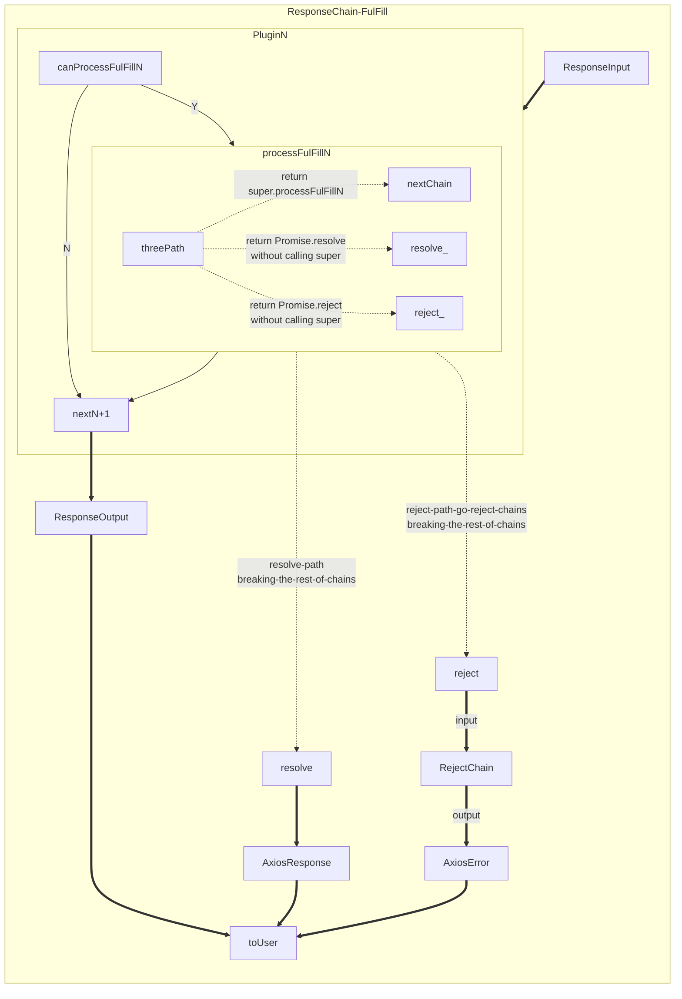
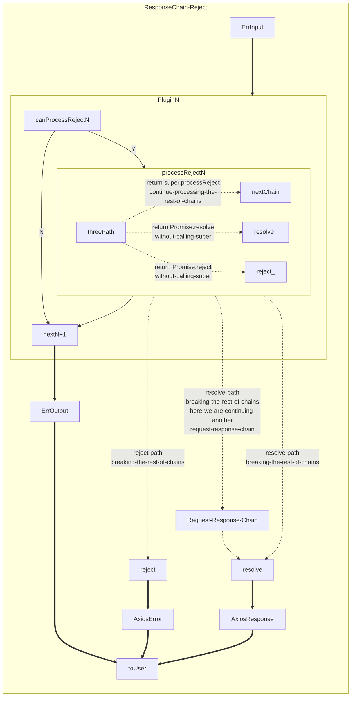
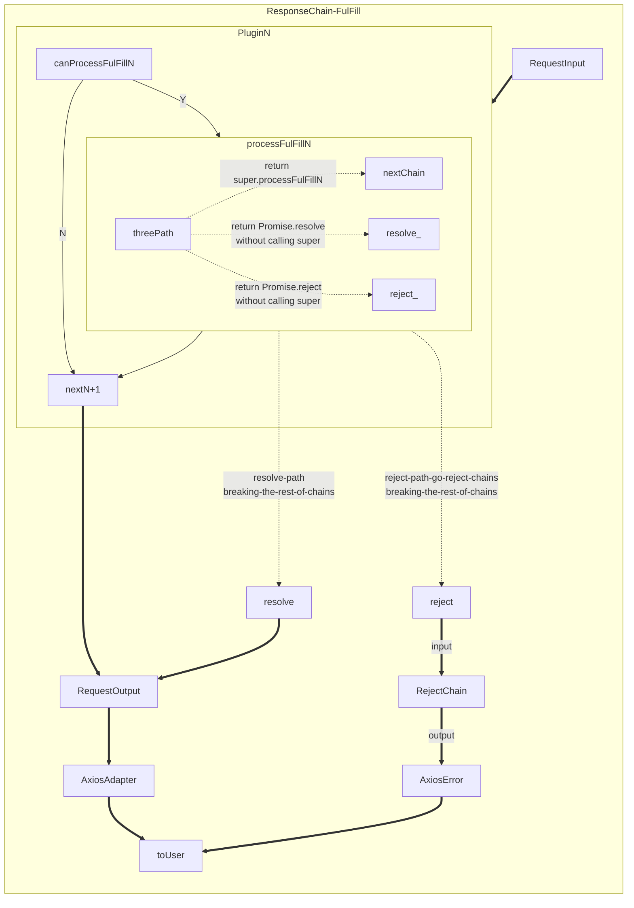

---
<!--#-->

### Request/Response 流程
實作主要建立在 axios 處理 interceptor 流程的基礎上，只是用 responsibility chain 的設計模式模組化，無論 Request/Response 都分為 onFulFill/onReject 二個流程，每個 chain 都必需實作 canProcess/process 二個方法，但因為有二個流程 (onFulFill/onReject) 所以 canProcess/Process 就變成 canProcessFulFill/processFulFill - canProcessReject/processReject，未來會合併為一個。

__目前的實作方法如下：__
- Request
  - onFulFill
    - canProcessFulFill > processFulFill
  - onReject
    - canProcessReject > processReject
- Response
  - onFulFill
    - canProcessFulFill > processFulFill
  - onReject
    - canProcessReject > processReject

意即在原來的 interceptor 中插入
```ts
function(requestConfig){}
  if (chain1.canProcessOnFulFill(requestConfig)){
    requestConfig = chain1.processFulFill(requestConfig)
  }
  if (chainN.canProcessOnFulFill(requestConfig)){
    ...
  }
}
```


#### ResponseChain-onFulFill
> interceptors 用來攔截「非錯誤」的 Response
> - canProcessFulFill 決定是否進入 processFulFill
> - processFulFill 實作時有三條路徑
>   - return super.processFulFill
>     當呼叫 super.processFulFill 時，內部會持續走下一個 ResponseChain, 意思是如果不 return super.processFulFill 就斷開整個 Chain
>   - not return super.processFulFill - Promise.reject
>     這會進入  ResponseChain-onReject 路徑
>   - not return super.processFulFill - Promise.resolve
>     這部份看如何實作，可能完全不走 Chain, 也可以繼續下一個 ResponseChain




#### ResponseChain-onReject
> interceptors 用來攔截「錯誤」的 Response
> - canProcessReject 決定是否進入 processReject
> - processReject 實作時有三條路徑
>   - return super.processReject
>     當呼叫 super.processReject 時，內部會持續走下一個 ResponseChain, 意思是如果not return super.processReject 就斷開整個 Chain
>   - not return super.processReject - Promise.reject
>     這會直接 reject 而不走剩下的 reject chain
>   - not return super.processReject - Promise.resolve
>     這部份看如何實作，可能完全不走 Chain, 也可以繼續下一個 ResponseChain



#### Request-onFulFill



### 常用 Response/Request Chain
#### BaseRequestChain

#### BaseResponseChain
#### ResponseChain-AuthGuard
#### RequestChain-AuthHeaderUpdater